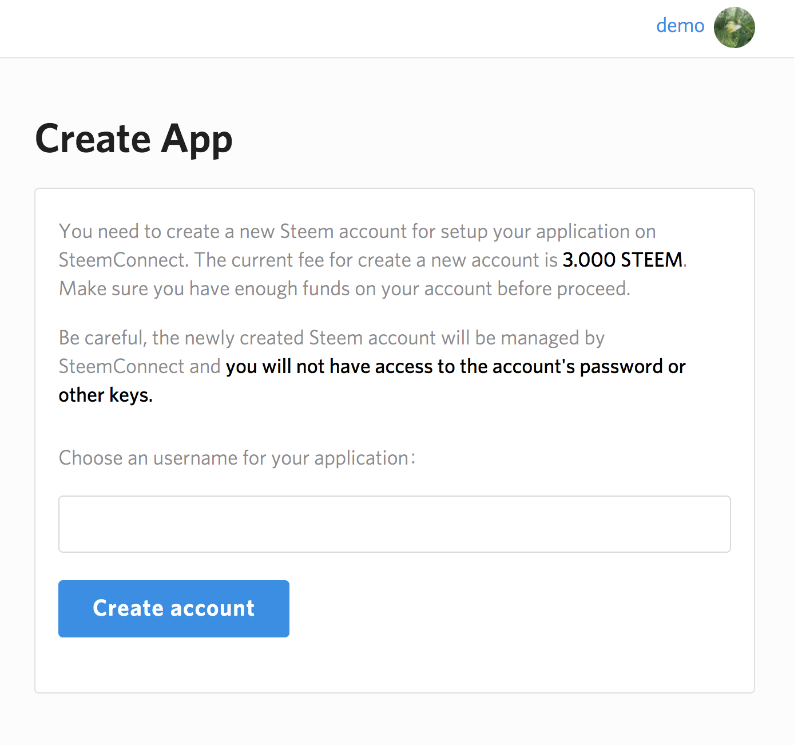
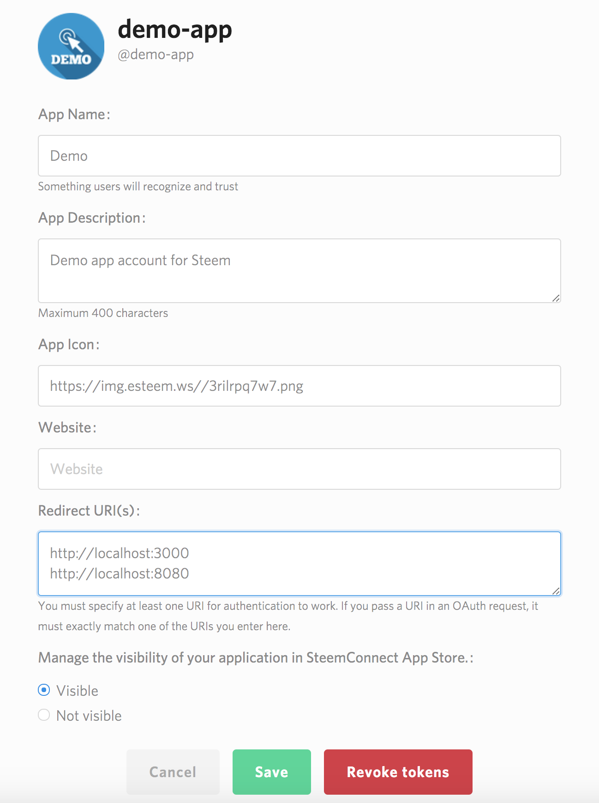

### Goal

The application in this tutorial asks the user to grant an access to `demo-app` and get token from Steemconnect. Once permission is granted, `demo-app` can get details of user via an api call that requires access token.
Purpose is to allow any application request permission from user and perform action via access token.

Some other calls that require an access token (or login) are:

*   Vote
*   Comment
*   Post
*   Follow
*   Reblog

Learn more about [Steemconnect operations here](https://github.com/steemit/steemconnect-sdk)

### Overview

Steemconnect is unified authentification system built on top of Steem built in collaboration of Busy.org and Steemit Inc.
Layer to ensure easy access and setup for all application developers as well as secure way for users to interact with Steem apps.

Setting up Steemconnect in your app is straight-forward process and never been this easy.

### Step I

Here are the steps that helps you to setup new app:

1.  Visit [Steemconnect Dashboard](https://steemconnect.com/dashboard) and login with your Steem credentials

2.  You will see Applications and Developers section, in Developers section click on `My Apps`

3.  Create New App using Steemconnect, which will help you create new Steem account for your application. Let's call it `demo-app` for this tutorial purpose.

Account creation fee will be deducted from your balance, make sure you have enough funds to complete account creation.

Next step is to login with account which has enough balance to pay for account creation fee.

4.  Give your app name, description, icon image link, website (if available) and Redirect URI(s)

Application name and description should give users clear understanding what permissions it requires and what is the purpose of the app.

App Icon field should be publicly accessible and available link to your logo or icon.

Website field is homepage for the application if exist.

Redirect URI(s) will be used within your application to forward user after authentification is successful. You can specify multiple callback URLs with each new line. Callback in Steemconnect SDK should match exactly one of URI(s) specified on this page. Due to security reasons if redirect URI(s) used in SDK is other than you specified, it will not work.
This is typical backend web development, we hope you know how to set up your backend/app to handle callback URLs.

*   Disclaimer: All images/screenshots of user interface may change as Steemconnect evolves

### Step II

Once you have setup account for new application, you can setup application with Steemconnect authentification and API processes.
To do that, you will need to install `sc2-sdk` nodejs package with `npm i sc2-sdk`.
Within application you can initialize Steemconnect

##### Initialize

> `app` - is account name for application that we have created in Step I.3, `callbackURL` - is Redirect URI that we have defined in Step I.4, `scope` - permissions application is requiring/asking from users

Now that `sc2-sdk` is initialized we can start authentication and perform simple operations with Steemconnect.

##### Login URL

> `getLoginURL` function you see on the right side, returns login URL which will redirect user to sign in with Steem connect screen. Successfull login will redirect user to Redirect URI or `callbackURL`. Result of successful login will return `access_token`, `expires_in` and `username` information, which application will start utilizing.

##### Request link

> Application can request returned link into popup screen or relevant screen you have developed. Popup screen will ask user to identify themselves with their username and password. Once login is successful, you will have Results

##### Result

> Returned data has `access_token` - which will be used in future api calls, `expires_in` - how long access token is valid in seconds and `username` of logged in user.

##### Set token

> After getting `access_token`, we can set token for future Steemconnect API requests.

##### Get user info

> Users info can be checked with `me` which will return object
> `account` - current state of account and its details on Steem blockchain, `name` - username, `scope` - permissions allowed with current login, `user` - username, `user_metadata` - additional information user has setup.

##### Logout

> In order to logout, you can use `revokeToken` function from sc2-sdk.

### To run

*   clone this repo
*   `cd tutorials/02_steemconnect`
*   `npm i`
*   `npm run start`

## To run in development mode

> Running in development mode will start a web server accessible from the following address: `http://localhost:3000/`. When you update the code the browser will automatically refresh to see your changes

*   clone this repo
*   `cd tutorials/02_steemconnect`
*   `npm i`
*   `npm run dev-server`
